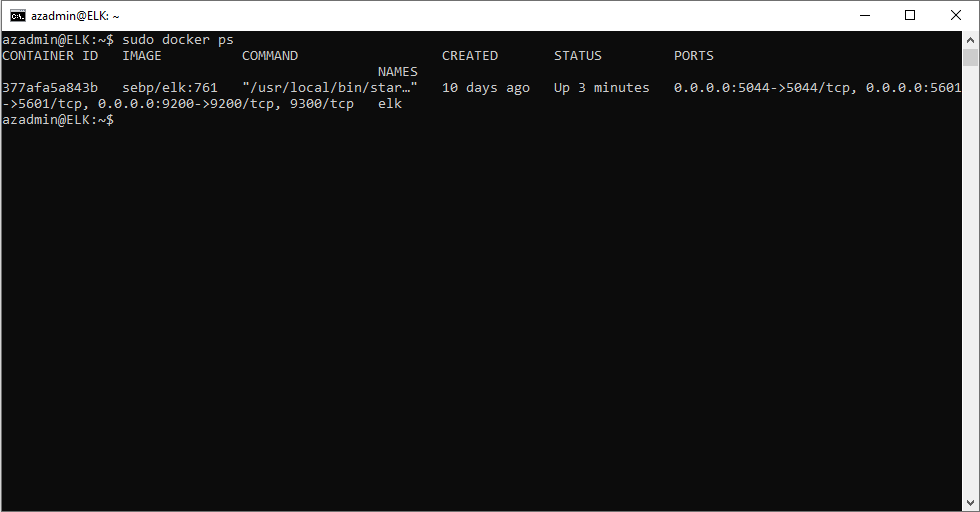

# Virtual-Machine-Project
Documentation for an Azure Virtual Network Setup deploying multiple web servers and an ELK server via ansible that monitors those web servers.

## Automated ELK Stack Deployment

The files in this repository were used to configure the network depicted below.

These files have been tested and used to generate a live ELK deployment on Azure. They can be used to either recreate the entire deployment pictured above. Alternatively, select portions of the README.md file may be used to install only certain pieces of it, such as Filebeat.

  - _TODO: Enter the playbook file._

This document contains the following details:
- Description of the Topologu
- Access Policies
- ELK Configuration
  - Beats in Use
  - Machines Being Monitored
- How to Use the Ansible Build

### Description of the Topology

The main purpose of this network is to expose a load-balanced and monitored instance of DVWA, the D*mn Vulnerable Web Application.

Load balancing ensures that the application will be highly available, in addition to restricting traffic to the network.
Load balancers help secure the availablity of web servers in the event of high volume or possible DDOS attacks.

Integrating an ELK server allows users to easily monitor the vulnerable VMs for changes to the data and system logs.
- _What does Filebeat record?_
Filebeat allows monitoring of system logs that you specify and sends those requests to Logstash and Elastic Search to be queried and searched by Kibana.
- _What does Metricbeat record?_
Metricbeat takes metrics and statisical information dealing with the health and usage of the system and forwards them off to Logstash and Elastic Search to be queried by Kibana. 

The configuration details of each machine may be found below.
_Note: Use the [Markdown Table Generator](http://www.tablesgenerator.com/markdown_tables) to add/remove values from the table_.

| Name     | Function | IP Address | Operating System |
|----------|----------|------------|------------------|
| Jump Box | Gateway  | 10.0.0.6 / 20.115.163.105  | Linux            |
| Web-1    |Web Server| 10.0.0.7 / 20.115.119.160   | Linux            |
| Web-2    |Web Server| 10.0.0.8   | Linux            |
| ELK      |ELK Server| 10.1.0.4   | Linux            |
|Load Balancer|Load Balancer|Static External IP| Linux|
|Host / WorkStation|Access Control|Public IP| Linux, Mac, or Windows|

### Access Policies

The machines on the internal network are not exposed to the public Internet. 

Only the Jumpbox machine can accept connections from the Internet. Access to this machine is only allowed from the following IP addresses:
- _Host/Workstation's Public IP address_

Machines within the network can only be accessed by the Jumpbox VM.
- _The ELK Server is only acessible from the Jumpbox VM and via a TCP connection on port 5601 used for Kibana._
- _Both Web-1 and Web-2 are only accessible from the Jumpbox VM._

A summary of the access policies in place can be found in the table below.

| Name     | Publicly Accessible | Allowed IP Addresses |
|----------|---------------------|----------------------|
| Jump Box | Yes                 | Host/Workstation Public IP   |
| Web-1    | No                  | 10.0.0.6             |
| Web-2    | No                  | 10.0.0.6             |
|ELK Server| Yes                 | 10.0.0.6             |

### Elk Configuration

Ansible was used to automate configuration of the ELK machine. No configuration was performed manually, which is advantageous because...
- _Ansible allows IT admins to automate daily tasks and cut away lots of the mind-numbing repetive tasks that can waste tons of time. For example if you needed to update 200 servers that your company was running, doing that manually would be tedious and time wasting, but with ansible it is as easy as writing one ansible playbook and depolying it._

The playbook implements the following tasks:
- _Install Docker_
- _Install python3-pip_
- _Install Docker python module_
- _Set the vm.max_map_count to 262144 to use more memory_
- _Download and launch the docker elk container_

The following screenshot displays the result of running `docker ps` after successfully configuring the ELK instance.

### Target Machines & Beats
This ELK server is configured to monitor the following machines:
- _Web-1  10.0.0.7_
- _Web-2  10.0.0.8_

We have installed the following Beats on these machines:
- _Filebeat_
- _Metricbeat_

These Beats allow us to collect the following information from each machine:
- _Filebeat collects log data, sends these logs to logstash and elastic search, and then gets visualized in dashboards in Kibana. An example of something you could expect to see from this data is successful and failed ssh attempts into the web servers._
- _Metricbeat on the other hand looks at system metrics of the box it is located on, that is then sent on to logstash and elastic search.  This information can also be viewed and queried in Kibana.  An expected example of something you may see from metricbeat data is the cpu usage and other system health indicators._   

### Using the Playbook
In order to use the playbook, you will need to have an Ansible control node already configured. Assuming you have such a control node provisioned: 

SSH into the control node and follow the steps below:
- Copy the _____ file to _____.
- Update the _____ file to include...
- Run the playbook, and navigate to ____ to check that the installation worked as expected.

_TODO: Answer the following questions to fill in the blanks:_
- _Which file is the playbook? Where do you copy it?_
- _Which file do you update to make Ansible run the playbook on a specific machine? How do I specify which machine to install the ELK server on versus which to install Filebeat on?_
- _Which URL do you navigate to in order to check that the ELK server is running?

_As a **Bonus**, provide the specific commands the user will need to run to download the playbook, update the files, etc._
